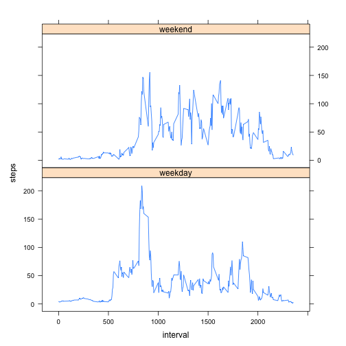

Reproducible Research: Peer Assessment 1
========================================================

## Loading and preprocessing the data


```r
amd <- read.csv(file = "activity.csv", sep = ",", head = T, colClasses = c("integer", 
    "Date", "integer"))
```


## What is mean total number of steps taken per day?


```r
steps_per_day <- sapply(split(amd$steps, amd$date), sum, na.rm = T)
hist(steps_per_day)
```

 

```r
steps_per_day_mean <- mean(steps_per_day)
steps_per_day_median <- median(steps_per_day)
```


## What is the average daily activity pattern?


```r
avg_per_int <- (sapply(split(amd$steps, amd$interval), mean, na.rm = T))
int <- (unique(amd$interval))
plot(x = int, y = avg_per_int, type = "l", xlab = "5-minute interval", ylab = "average number of step")
```

 

```r
per_int <- sapply(split(amd$steps, amd$interval), sum, na.rm = T)
int_max <- which.max(per_int)
max_step <- int[int_max]
```


## Imputing missing values


```r
nrow(na.omit(amd))
```

```
## [1] 15264
```

```r
sum(is.na(amd))
```

```
## [1] 2304
```

```r
new_data <- amd
for (i in 1:nrow(new_data)) {
    if (is.na(new_data$steps[i])) {
        new_data[i, ]$steps <- avg_per_int[(i%%150) + 1]
    }
}
t_steps_day <- sapply(split(new_data$steps, new_data$date), sum, na.rm = T)
hist(t_steps_day)
```

 

```r
new_mean <- mean(t_steps_day)
new_median <- median(t_steps_day)
```


## Are there differences in activity patterns between weekdays and weekends?


```r
new_data$day = ifelse(as.POSIXlt(as.Date(new_data$date))$wday%%6 == 0, "weekend", 
    "weekday")
new_data$day = factor(new_data$day, levels = c("weekday", "weekend"))
s_int = aggregate(steps ~ interval + day, new_data, mean)

library(lattice)
xyplot(steps ~ interval | factor(day), data = s_int, aspect = 1/2, type = "l")
```

 

